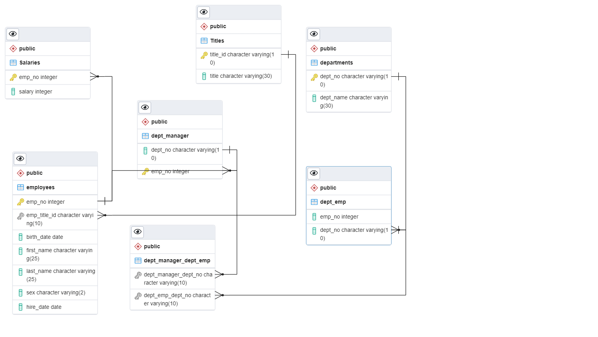

# **SQL Challenge**
---
## Just a few queries on archived employment data from Pewlett Hackard using PostgreSQL
###  1. First I brought in the data and created an Entity Relationship Diagram using PG Admin 
####  - I made the key connections using the software then generated the schema script
###  - 

